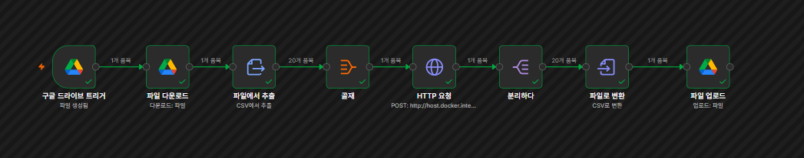

# 🏢 공유오피스 3일 체험 고객 결제 전환 예측

공유오피스 **3일 무료체험 고객의 이용 행동을 분석하고 결제 전환 가능성을 예측하는 머신러닝 프로젝트**입니다.  
방문·체류·입실 행동을 기반으로 결제 전환 요인을 분석하고, **XGBoost → FastAPI → Streamlit → n8n**으로 이어지는 예측 및 자동화 환경을 구현했습니다.

---

## 🎬 Demo

[](https://youtu.be/_-W1URhU9to)

> 고객 데이터 입력 → 결제 전환 예측 → n8n 자동 처리 → 예측 결과 Google Drive 저장

---

## 🔎 Project Overview

| 구분 | 내용 |
|---|---|
| **목표** | 무료체험 고객 중 결제 전환 가능성이 높은 고객 식별 |
| **분석 대상** | 공유오피스 3일 무료체험 고객 |
| **전체 신청자** | 9,624명 |
| **최종 모델링 표본** | 5,629명 |
| **최종 모델** | XGBoost Classifier |
| **모델 피처** | 42개 |
| **서비스** | Streamlit + FastAPI |
| **자동화** | n8n + Google Drive |

---

## 📚 Analysis Process

분석 과정은 단계별 Jupyter Notebook으로 구성했습니다.

| Notebook | 내용 |
|---|---|
| `00_project_overview.ipynb` | 프로젝트 배경 및 문제 정의 |
| `01_data_preprocessing.ipynb` | 원본 데이터 정제 및 사용자 단위 테이블 생성 |
| `02_eda_analysis.ipynb` | 고객 행동 변수 생성 및 결제 전환 패턴 분석 |
| `03_model_experiment.ipynb` | Logistic Regression · Random Forest · XGBoost 비교 |
| `04_model_tuning_final.ipynb` | Feature Engineering · XGBoost 튜닝 · 모델 저장 |
| `05_streamlit_prepare.ipynb` | 서비스용 모델 검증 및 예측 샘플 생성 |

```text
Raw Data
   ↓
Preprocessing
   ↓
EDA & Feature Engineering
   ↓
Model Experiment
   ↓
XGBoost Tuning
   ↓
Streamlit / FastAPI
   ↓
n8n Automation
```

---

## 📊 Key Findings

체험 고객의 이용 행동을 분석한 결과 다음과 같은 행동 특성이 결제 전환 예측에 주요하게 활용되었습니다.

- 고객의 **평균 체류 시간**
- 체험 기간 중 **최초 방문 시간**
- 고객의 **하루 평균 입실 횟수**
- **체험 기간 동안 방문한 일수**
- 체험 신청 후 **첫 방문까지 걸린 기간**

특히 단순 방문 여부보다 **방문 빈도와 체류 패턴의 조합**이 결제 전환을 구분하는 데 중요하게 나타났습니다.

---

## 🤖 Prediction Model

기본 행동 변수에 상호작용·비율·시간대·로그 변수를 추가하여 최종적으로 **42개 Feature**를 사용했습니다.

### Final Model

```python
XGBClassifier(
    n_estimators=700,
    learning_rate=0.02,
    max_depth=2,
    gamma=0.3,
    colsample_bytree=0.7,
    scale_pos_weight=2.0
)
```

| 지표 | 결과 |
|---|---:|
| Accuracy | **0.4432** |
| Precision | **0.3982** |
| Recall | **0.9363** |
| F1-score | **0.5588** |
| ROC-AUC | **0.6310** |
| Prediction Threshold | **0.35** |

모델은 단순 Accuracy보다 **결제 가능 고객을 놓치지 않는 Recall**을 중요하게 보고 운영 Threshold를 조정했습니다.

---

## 🖥️ Prediction Service

Streamlit에서 고객 행동 데이터를 입력하면 동일한 42개 피처로 변환한 뒤 XGBoost 모델이 결제 가능성을 예측합니다.  
FastAPI는 n8n 자동화에서 사용할 수 있도록 `/predict` 엔드포인트를 제공합니다.

```text
고객 행동 데이터
      ↓
Streamlit / n8n
      ↓
FastAPI
      ↓
42개 Feature 생성
      ↓
XGBoost
      ↓
결제 확률 / 예측 결과
```

---

## ⚙️ n8n Automation



Google Drive에 신규 고객 CSV가 업로드되면 예측 프로세스가 자동 실행됩니다.

```text
Google Drive Trigger
        ↓
파일 다운로드
        ↓
CSV 데이터 추출
        ↓
데이터 집계
        ↓
FastAPI HTTP 요청
        ↓
예측 결과 분리
        ↓
CSV 변환
        ↓
Google Drive 업로드
```

**파일 업로드만으로 고객별 결제 전환 예측 결과가 생성되도록 자동화**했습니다.

---

## 🛠 Tech Stack


---

## 📁 Repository Structure

```text
shared-office-conversion-prediction/
│
├── app/
│   ├── app.py
│   └── prediction_api.py
│
├── assets/
│   └── n8n_workflow.png
│
├── data/
│   ├── README.md
│   └── sample/
│       └── prediction_input_sample.csv
│
├── models/
│   ├── best_tuned_model.pkl
│   ├── best_tuned_threshold.pkl
│   ├── feature_cols.json
│   ├── feature_medians.json
│   ├── model_metrics.json
│   └── README.md
│
├── notebooks/
│   ├── 00_project_overview.ipynb
│   ├── 01_data_preprocessing.ipynb
│   ├── 02_eda_analysis.ipynb
│   ├── 03_model_experiment.ipynb
│   ├── 04_model_tuning_final.ipynb
│   └── 05_streamlit_prepare.ipynb
│
├── .gitignore
├── requirements.txt
└── README.md
```

---

## 🔒 Data

원본 데이터에는 사용자 이용 로그 및 식별 정보가 포함되어 있어 **GitHub에 공개하지 않습니다.**

로컬에서 전체 분석 과정을 재현하려면 다음 파일을 `data/raw/`에 직접 배치해야 합니다.

```text
data/raw/
├── site_area.csv
├── trial_register.csv
├── trial_visit_info.csv
├── trial_access_log.csv
└── trial_payment.csv
```

GitHub에는 실제 고객 식별자가 없는 `data/sample/prediction_input_sample.csv`만 공개합니다.

`.gitignore`를 통해 아래 경로는 Git 추적 대상에서 제외합니다.

```text
data/raw/
data/interim/
data/processed/
runtime/
```

---

## ▶️ Run

### 1. 가상환경 생성

```bash
python -m venv .venv
```

Git Bash 기준 활성화:

```bash
source .venv/Scripts/activate
```

### 2. 패키지 설치

```bash
python -m pip install -r requirements.txt
```

### 3. FastAPI 실행

저장소 루트에서 실행합니다.

```bash
python -m uvicorn app.prediction_api:app --reload
```

API 문서:

```text
http://127.0.0.1:8000/docs
```

### 4. Streamlit 실행

새 터미널에서 실행합니다.

```bash
python -m streamlit run app/app.py
```

```text
http://localhost:8501
```

### 5. n8n 실행

기존 로컬 Docker 컨테이너를 사용하는 경우:

```bash
docker start n8n
```

```text
http://localhost:5678
```
